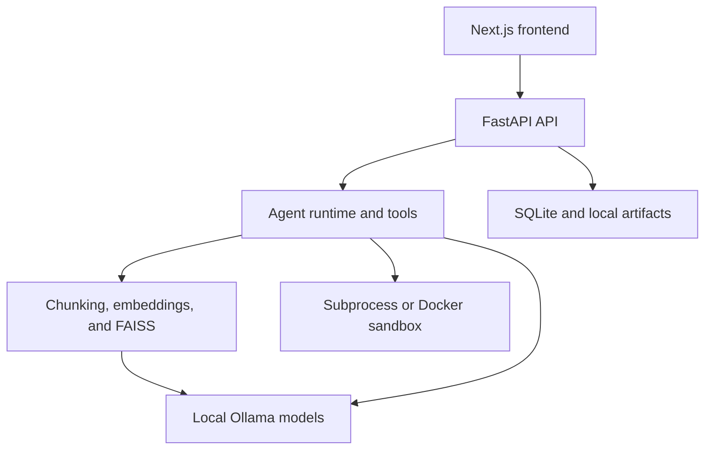

Local AI Software Engineer
An AI coding agent built around locally hosted models. It can index a local Git repository, retrieve relevant code, plan a change, edit files, run tests, analyze failures, and stream its progress through a web interface—with reasoning and embeddings handled by your configured Ollama instance.
Maintained by Mohammed Ameen.
A local development tool for repository investigation, code changes, and test-driven iteration. Designed for individual use; generated changes require review.
What it does
Given a repository path and a natural-language task, the application can:
Index supported source files and split them into searchable chunks.
Generate local embeddings with Ollama and store them in FAISS.
Retrieve code relevant to the requested change.
Inspect files and references through typed, validated tools.
Propose and apply controlled source-code patches.
Run configured tests, linters, formatters, and allowlisted commands.
Analyze failures and iterate within a configurable limit.
Stream the complete run timeline, diffs, test results, and final report to the frontend.
Inference and embeddings run locally with the default configuration. No hosted LLM API key is required. Initial dependency installation and model downloads require internet access.
Highlights
Local inference: Ollama-backed reasoning and embedding models.
Repository-aware retrieval: Python AST chunking, generic sliding-window chunking, incremental indexing, and FAISS similarity search.
Autonomous workflow: investigation, planning, patching, testing, and retry logic.
Controlled tools: Pydantic-validated inputs, execution timeouts, output limits, and explicit command allowlists.
Live interface: Next.js UI with Server-Sent Events, run cancellation, code views, diffs, tests, and reports.
Persistent sessions: repository-scoped conversations, history, token usage, and context-window tracking.
Model management: list, install, select, and remove local Ollama models from the UI.
Evaluation harness: isolated tasks with independent before-and-after test snapshots.
Observability: request IDs, run IDs, duration tracking, and text or JSON logs.
Optional Docker isolation: no network access, limited filesystem exposure, and configurable CPU/memory limits.
Improvements in this version
Batched embeddings: `EMBEDDING_BATCH_SIZE` limits each Ollama embedding request, reducing peak demand when indexing large repositories.
Multiple frontend origins: comma-separated CORS configuration supports more than one frontend address.
Windows development notes: documented indexing results and platform-specific test behavior.
The repository notice records a local indexing run of 1,319 chunks in 168 seconds on a GTX 1650 with 4 GB of VRAM. This is a recorded development result, not a general performance benchmark or a guarantee for other machines. See NOTICE.md for the change record.
Architecture

Main components
Component	Responsibility
FastAPI backend	API routes, validation, dependency wiring, and background agent execution
Agent runtime	Planning, tool selection, iteration, termination, and loop detection
Retrieval pipeline	Repository walking, chunking, embeddings, reconciliation, and FAISS search
Tool registry	File inspection, semantic search, Git inspection, patching, and controlled execution
SQLite	Repositories, chunks, sessions, runs, events, tool calls, test results, and settings
Next.js frontend	Repository selection, chat sessions, model management, live progress, diffs, and reports
Evaluation framework	Repeatable fixture tasks and independent outcome scoring
Technology stack
Layer	Technologies
Backend	Python 3.11+, FastAPI, Pydantic, SQLAlchemy, Uvicorn
Frontend	Next.js 16, React 19, TypeScript, Tailwind CSS
Local AI	Ollama, `qwen2.5-coder:7b`, `nomic-embed-text`
Retrieval	FAISS, NumPy, local embeddings
Persistence	SQLite and local FAISS index files
Testing and quality	Pytest, pytest-asyncio, Ruff, ESLint
Isolation	Allowlisted subprocesses or Docker
Requirements
Python 3.11 or newer
Node.js 22 LTS for the Next.js frontend
npm
Ollama
Git
Docker (optional, for stronger command isolation)
The default models require several gigabytes of disk space. Runtime speed and model quality depend on the available CPU, GPU, and memory.
Quick start
macOS or Linux
```bash
git clone https://github.com/ameenpasha69/aisoftwareengineer.git
cd aisoftwareengineer

./scripts/setup.sh
cd frontend
npm install
cp .env.local.example .env.local
cd ..
```
Start the backend:
```bash
./scripts/start.sh
```
In a second terminal, start the frontend:
```bash
cd frontend
npm run dev
```
Windows PowerShell
Use a Python 3.11+ installation, and start Ollama before pulling the models.
```powershell
git clone https://github.com/ameenpasha69/aisoftwareengineer.git
cd aisoftwareengineer

py -m venv .venv
.\.venv\Scripts\Activate.ps1
python -m pip install --upgrade pip
pip install -e ".[dev]"

Copy-Item .env.example .env
Copy-Item frontend\.env.local.example frontend\.env.local

ollama pull qwen2.5-coder:7b
ollama pull nomic-embed-text

cd frontend
npm install
cd ..
```
Start the backend:
```powershell
.\.venv\Scripts\Activate.ps1
python -m uvicorn app.main:app --reload --port 8000 --app-dir backend
```
In a second PowerShell terminal, start the frontend:
```powershell
cd frontend
npm run dev
```
Open:
Web interface: http://localhost:3000
API documentation: http://localhost:8000/docs
Health endpoint: http://localhost:8000/api/health
Using the application
Ensure Ollama, the backend, and the frontend are running.
Open http://localhost:3000.
Add a repository using its absolute local path.
Wait for chunking and embedding to complete.
Create a chat session for the indexed repository.
Describe a specific task, such as `Fix the failing price calculation test and explain the cause.`
Review the agent timeline, retrieved code, patch, test results, and final report.
Inspect the repository diff before accepting or committing any change.
The repository being analyzed must exist on the same machine as the backend. A path from another computer or from the browser alone is not accessible to the agent.
Configuration
Copy `.env.example` to `.env` and adjust values as needed. Optional settings not present in the example can be added to `.env`.
Variable	Default	Purpose
`LOG_LEVEL`	`INFO`	Backend logging level
`LOG_FORMAT`	`text`	Human-readable `text` or structured `json` logs
`DATA_DIR`	`./data`	SQLite database and FAISS index location
`FRONTEND_ORIGIN`	`http://localhost:3000`	Comma-separated browser origins allowed by CORS
`LLM_PROVIDER`	`ollama`	Reasoning-model provider; only Ollama is currently implemented
`LLM_MODEL`	`qwen2.5-coder:7b`	Default reasoning model
`LLM_BASE_URL`	`http://localhost:11434`	Ollama API endpoint
`LLM_REQUEST_TIMEOUT_SECONDS`	`120`	LLM request timeout
`EMBEDDING_PROVIDER`	`ollama`	Embedding provider; only Ollama is currently implemented
`EMBEDDING_MODEL`	`nomic-embed-text`	Default embedding model
`EMBEDDING_BASE_URL`	`http://localhost:11434`	Embedding API endpoint
`EMBEDDING_BATCH_SIZE`	`64`	Maximum texts sent in one embedding request
`MAX_AGENT_ITERATIONS`	`8`	Maximum reasoning/tool iterations per run
`SANDBOX_BACKEND`	`subprocess`	`subprocess` or `docker` command execution
`SANDBOX_DOCKER_MEMORY_LIMIT`	`512m`	Memory limit for sandbox containers
`SANDBOX_DOCKER_CPU_LIMIT`	`1.0`	CPU limit for sandbox containers
The frontend uses `NEXT_PUBLIC_API_BASE_URL` from `frontend/.env.local` and defaults to `http://localhost:8000`.
Troubleshooting
Symptom	What to check
Ollama is unreachable	Start the Ollama application or `ollama serve`, then check `LLM_BASE_URL` and `EMBEDDING_BASE_URL`.
Model not found	Run `ollama list`; pull the model named in your configuration if missing.
Embedding request fails on a large repository	Lower `EMBEDDING_BATCH_SIZE`, confirm available memory, and re-index.
Frontend cannot reach the backend	Check the health endpoint, `NEXT_PUBLIC_API_BASE_URL`, and `FRONTEND_ORIGIN`; restart the affected service after configuration changes.
Search misses recently changed files	Re-index the repository after edits or an embedding-model change.
Agent stops before completing the task	Inspect tool failures and the iteration limit; provide a narrower task with a file path and an observable expected result.
Optional Docker sandbox
The default subprocess backend uses an allowlist and a restricted environment, but the child process can still access the host filesystem and network. Docker mode provides a stronger boundary.
Build the sandbox image:
```bash
docker build -f docker/sandbox.Dockerfile -t local-ai-softeng-sandbox:latest .
```
Then set the following in `.env`:
```dotenv
SANDBOX_BACKEND=docker
```
Docker mode mounts only the target repository, disables container networking, and applies the configured CPU and memory limits. The included image is primarily prepared for Python tooling.
Testing
Backend tests do not require Ollama because they use a fake LLM provider and temporary databases.
```bash
source .venv/bin/activate
pytest -q
```
On Windows PowerShell:
```powershell
.\.venv\Scripts\Activate.ps1
pytest -q
```
Frontend checks:
```bash
cd frontend
npm run lint
npm run build
```
The repository notice records Windows failures involving path separators, symlinks, and subprocess behavior. Investigate failures on your platform before relying on a run; the commands above are validation instructions, not a claim that the current suite passes.
Evaluation
The evaluation runner executes isolated fixture repositories and scores final repository behavior independently of the agent's own report.
```bash
source .venv/bin/activate
PYTHONPATH=backend python3 -m app.evaluation.run
```
To compare another installed model:
```bash
PYTHONPATH=backend python3 -m app.evaluation.run \
  --llm-model qwen2.5-coder:14b \
  --output evals/runs/qwen-14b.json
```
Reports include success rate, first-attempt success, regressions, retrieval hit rate, iteration count, tool calls, and runtime. The four included tasks are a functional evaluation set, not a statistically meaningful benchmark.
Project structure
```text
backend/
  app/
    agents/          Agent planning, execution, state, and loop detection
    api/routes/      FastAPI endpoints
    config/          Environment-backed settings
    database/        SQLAlchemy models, sessions, and additive migrations
    embeddings/      Embedding-provider abstraction and Ollama implementation
    evaluation/      Task loading, snapshots, scoring, and CLI runner
    execution/       Subprocess and Docker sandbox backends
    llm/             LLM abstraction, Ollama provider, catalog, and model manager
    observability/   Logging and request/run correlation
    retrieval/       Walking, chunking, indexing, FAISS, and reranking
    schemas/         Pydantic API models
    tools/           Typed investigation, Git, patch, and execution tools
  tests/             Backend test suite
frontend/
  app/               Next.js application shell and styles
  components/        Chat, timeline, model, diff, test, and report UI
  lib/               API client, types, streaming, formatting, and hooks
docker/              Optional sandbox image
evals/               Evaluation fixtures and generated run artifacts
scripts/             Setup and startup helpers
data/                Local database and vector indexes; not committed
```
Current limitations
Only Ollama is implemented for LLM inference, embeddings, and model management.
Repositories must be re-indexed manually after the agent modifies files.
Switching embedding models clears incompatible vectors but does not automatically rebuild them.
Python receives AST-aware chunks; other languages use syntax-unaware sliding windows.
Repository-specific `.gitignore` rules are not currently used by the indexer.
Loop detection catches identical calls, not all semantically equivalent retries.
A model's final natural-language claim is not independently verified unless it is covered by executed tests or the evaluation harness.
Session history is truncated rather than summarized when it exceeds the available context.
Background task tracking is process-local, so an active run cannot survive a backend restart.
Docker isolation is optional and its bundled tooling is primarily Python-focused.
Reranking uses lexical overlap, not a learned cross-encoder.
The flat FAISS index is appropriate for local repositories but not designed for millions of chunks.
Small local models can select unproductive tools, repeat near-duplicate actions, or stop without completing a valid fix.
This is a local engineering project, not a hardened multi-user or public-internet service. It has no authentication or authorization layer.
Security
Run the application only on a machine and network you trust. By default, both services are intended for localhost use. Do not expose the backend publicly: the agent can read and modify indexed repositories and execute allowlisted development commands.
For stronger command isolation, enable the Docker sandbox and still review every generated diff before committing it.
If you discover a security issue, report it privately to the repository maintainer instead of opening a public exploit report.
Roadmap
Automatically re-index changed files after successful patches.
Add syntax-aware chunkers for JavaScript, TypeScript, Java, Go, and Rust.
Normalize tool inputs before loop detection.
Add independent verification of file-state claims.
Summarize long session histories instead of dropping older context.
Add persistent job execution for restart-safe agent runs.
Expand the Docker sandbox with additional language toolchains.
Add more evaluation tasks and repeated multi-model comparison reports.
Add authentication before considering any shared or remote deployment.
Contributing
Read NOTICE.md for project provenance and permission details before reusing or redistributing the source.
For proposed changes:
Create a focused branch.
Describe the problem and expected behavior.
Add or update tests when changing behavior.
Run the backend tests and frontend checks.
Open a pull request with the relevant validation results and known limitations.
Maintainer
Mohammed Ameen  
GitHub: @ameenpasha69
Licensing and provenance
See NOTICE.md for the repository's origin, permission details, and modification record. This README does not grant a license or change those terms.
